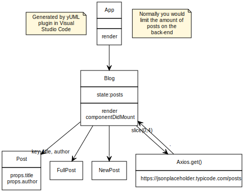
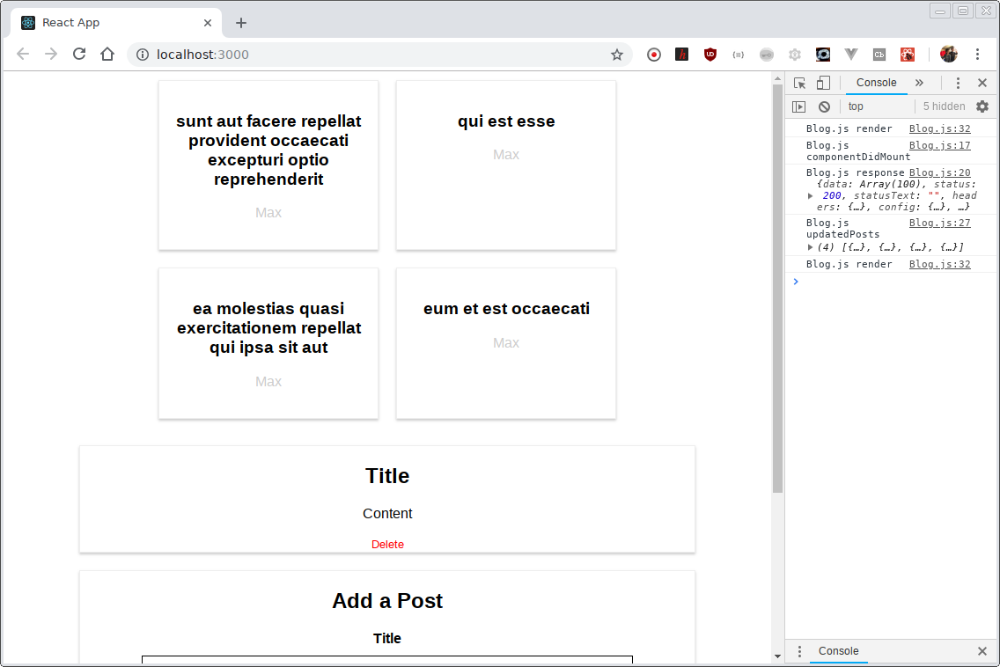

# Test project

To learn about react and http https://www.udemy.com/react-the-complete-guide-incl-redux/learn/v4/t/lecture/8125770?start=0

# Set up
1. `git clone ...`
2. `npm i`
3. `npm start`

# Design



# Additional set up done already
After clean install

```bash
found 366 vulnerabilities (317 low, 34 moderate, 14 high, 1 critical) in 11132 scanned packages
  366 vulnerabilities require semver-major dependency updates.
gius@dev:~/react-http$ npm outdated
Package        Current  Wanted  Latest  Location
react           16.0.0  16.5.2  16.5.2  react-complete-guide
react-dom       16.0.0  16.5.2  16.5.2  react-complete-guide
react-scripts   1.0.13  1.0.13   1.1.5  react-complete-guide

npm i --save react@latest react-dom@latest react-scripts@latest

gius@dev:~/react-http$ npm audit
                                                                                
                       === npm audit security report ===                        
                                                                                
found 0 vulnerabilities
 in 14541 scanned packages
gius@dev:~/react-http$ 

```

Much better